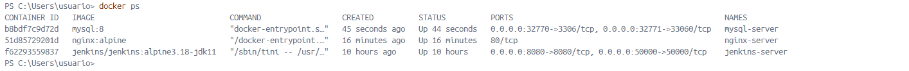

# Variables de Entorno
### ¿Qué son las variables de entorno

Las variables de entorno son valores dinámicos que afectan el comportamiento de procesos o aplicaciones en el sistema operativo. Son un método para almacenar información que puede ser utilizada por varios programas y procesos. En el contexto de Docker, las variables de entorno se pueden usar para configurar un contenedor de manera más flexible, sin necesidad de modificar su código.


### Para crear un contenedor con variables de entorno?

Para crear un contenedor con variables de entorno, puedes usar el comando -e para cada variable que quieras definir.

```
docker run -d --name <nombre contenedor> -e <nombre variable1>=<valor1> -e <nombre variable2>=<valor2>
```

### Crear un contenedor a partir de la imagen de nginx:alpine con las siguientes variables de entorno: username y role. Para la variable de entorno rol asignar el valor admin.

```
docker run -d --name nginx-server -e username='user123' -e role='admin' nginx:alpine
```


# CAPTURA CON LA COMPROBACIÓN DE LA CREACIÓN DE LAS VARIABLES DE ENTORNO DEL CONTENEDOR ANTERIOR

Para comprobar que las variables de entorno se han creado correctamente dentro del contenedor, ejecutamos el siguiente comando:

```
docker exec nginx-server printenv
```


### Crear un contenedor con mysql:8 , mapear todos los puertos

```
docker run -d --name mysql-server -P mysql:8
```


### ¿El contenedor se está ejecutando?

Para verificar si el contenedor está en ejecución, utilizamos el siguiente comando:

```
docker ps
```


### Identificar el problema

Si el contenedor no está en ejecución, utilizamos el siguiente comando para ver los logs del contenedor y diagnosticar el problema:

```
docker logs mysql-server
```


### Eliminar el contenedor creado con mysql:8 

Si el contenedor no se está ejecutando correctamente y deseas eliminarlo, utilizamos el siguiente comando:

```
docker rm -f mysql-server
```


### Para crear un contenedor con variables de entorno especificadas
- Portabilidad: Las aplicaciones se vuelven más portátiles y pueden ser desplegadas en diferentes entornos (desarrollo, pruebas, producción) simplemente cambiando el archivo de variables de entorno.
- Centralización: Todas las configuraciones importantes se centralizan en un solo lugar, lo que facilita la gestión y auditoría de las configuraciones.
- Consistencia: Asegura que todos los miembros del equipo de desarrollo o los entornos de despliegue utilicen las mismas configuraciones.
- Evitar Exposición en el Código: Mantener variables sensibles como contraseñas, claves API, y tokens fuera del código fuente reduce el riesgo de exposición accidental a través del control de versiones.
- Control de Acceso: Los archivos de variables de entorno pueden ser gestionados con permisos específicos, limitando quién puede ver o modificar la configuración sensible.

Previo a esto es necesario crear el archivo y colocar las variables en un archivo, **.env** se ha convertido en una convención estándar, pero también es posible usar cualquier extensión como **.txt**.
```
docker run -d --name <nombre contenedor> --env-file=<nombreArchivo>.<extensión> <nombre imagen>
```
**Considerar**
Es necesario especificar la ruta absoluta del archivo si este se encuentra en una ubicación diferente a la que estás ejecutando el comando docker run.

### Crear un contenedor con mysql:8 , mapear todos los puertos y configurar las variables de entorno mediante un archivo

* Crea un archivo .env con las variables necesarias. Por ejemplo, podemos crear un archivo mysql.env con el siguiente contenido:

```
MYSQL_ROOT_PASSWORD=my-secret-pw
MYSQL_DATABASE=mydb
MYSQL_USER=user123
MYSQL_PASSWORD=user-password
```

* Ejecutamos el siguiente comando para crear el contenedor de MySQL usando este archivo de variables de entorno:

```
docker run -d --name mysql-server --env-file=./mysql.env -P mysql:8
```

Esto creará el contenedor utilizando las variables definidas en mysql.env.




### ¿Qué bases de datos existen en el contenedor creado?

Para listar las bases de datos que existen en el contenedor de MySQL, seguimos los siguientes pasos:
* Abrimos una shell interactiva dentro del contenedor de MySQL:
  ```
  docker exec -it mysql-server mysql -u root -p
  ```
* Introducimos la contraseña de root que definiste en el archivo .env.
* Una vez dentro del shell de MySQL, ejecuta el siguiente comando para listar las bases de datos:
  ```
  SHOW DATABASES;
  ```

