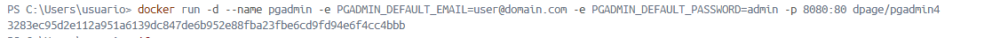

### Crear contenedor de Postgres sin que exponga los puertos. Usar la imagen: postgres:11.21-alpine3.17

Para crear un contenedor de PostgreSQL usando la imagen postgres:11.21-alpine3.17 y sin exponer puertos, utilizamos el siguiente comando:

```
docker run -d --name postgres-server -e POSTGRES_PASSWORD=mysecretpassword postgres:11.21-alpine3.17
```


### Crear un cliente de postgres. Usar la imagen: dpage/pgadmin4

Ahora, vamos a crea un contenedor para pgAdmin utilizando la imagen dpage/pgadmin4. Utilizando el siguiente comando:

```
docker run -d --name pgadmin -e PGADMIN_DEFAULT_EMAIL=user@domain.com -e PGADMIN_DEFAULT_PASSWORD=admin -p 8080:80 dpage/pgadmin4
```



La figura presenta el esquema creado en donde los puertos son:
- a: 5432 (puerto predeterminado de PostgreSQL)
- b: 80 (puerto del servidor web de pgAdmin)
- c: 8080 (puerto expuesto en el host para pgAdmin)


## Desde el cliente
### Acceder desde el cliente al servidor postgres creado.

* Abrimos el navegador y accedemos a http://localhost:8080 para abrir pgAdmin.
* Inicia sesión con el correo electrónico y la contraseña que configuramos.
  
  

### Crear la base de datos info, y dentro de esa base la tabla personas, con id (serial) y nombre (varchar), agregar un par de registros en la tabla, obligatorio incluir su nombre.
  
## Desde el servidor postgresl
### Acceder al servidor
### Conectarse a la base de datos info
# COMPLETAR
### Realizar un select *from personas
# AGREGAR UNA CAPTURA DE PANTALLA DEL RESULTADO
