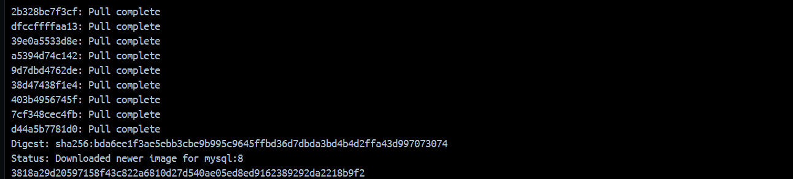

## Esquema para el ejercicio


### Crear la red

Primero, creamos la red net-wp donde se conectarán ambos contenedores, MySQL y WordPress.

```
docker network create net-wp
```


### Crear el contenedor mysql a partir de la imagen mysql:8, configurar las variables de entorno necesarias

Usamos la imagen mysql:8 para crear el contenedor de MySQL, especificando las variables de entorno necesarias para la base de datos, como la contraseña del root y el nombre de la base de datos.

```
docker run -d --name mysql-server --network net-wp \
  -e MYSQL_ROOT_PASSWORD=my-secret-pw \
  -e MYSQL_DATABASE=wordpress \
  -e MYSQL_USER=user123 \
  -e MYSQL_PASSWORD=user-password \
  mysql:8
```




### Crear el contenedor wordpress a partir de la imagen: wordpress, configurar las variables de entorno necesarias

Ahora creamos el contenedor WordPress usando la imagen wordpress y vinculamos este contenedor a la base de datos que creamos previamente. También se debe mapear el puerto del contenedor a uno en el host para acceder desde el navegador.

```
docker run -d --name wordpress-server --network net-wp \
  -e WORDPRESS_DB_HOST=mysql-server \
  -e WORDPRESS_DB_NAME=wordpress \
  -e WORDPRESS_DB_USER=user123 \
  -e WORDPRESS_DB_PASSWORD=user-password \
  -p 9300:80 \
  wordpress
```


De acuerdo con el trabajo realizado, en la el esquema de ejercicio el puerto a es **(completar con el valor)**

Ingresar desde el navegador al wordpress y finalizar la configuración de instalación.

Ahora que el contenedor de WordPress está en ejecución y expuesto en el puerto 9300, abrimos un navegador y accede a:

http://localhost:9300

Completamos la instalación de WordPress siguiendo los pasos que te solicite (idioma, nombre del sitio, usuario administrador, etc.).


Desde el panel de admin: cambiar el tema y crear una nueva publicación.
Ingresar a: http://localhost:9300/ 
recordar que a es el puerto que usó para el mapeo con wordpress
# COLOCAR UNA CAPTURA DEL SITO EN DONDE SEA VISIBLE LA PUBLICACIÓN.


### Eliminar el contenedor wordpress

Para eliminar el contenedor de WordPress, usamos el siguiente comando:

```
docker rm -f wordpress-server
```


### Crear nuevamente el contenedor wordpress

```
docker run -d --name wordpress-server --network net-wp `
  -e WORDPRESS_DB_HOST=mysql-server `
  -e WORDPRESS_DB_NAME=wordpress `
  -e WORDPRESS_DB_USER=user123 `
  -e WORDPRESS_DB_PASSWORD=user-password `
  -p 9300:80 `
  wordpress
```


Ingresar a: http://localhost:9300/ 
recordar que a es el puerto que usó para el mapeo con wordpress


### ¿Qué ha sucedido, qué puede observar?

Al eliminar el contenedor de WordPress, también se eliminan los datos de configuración del sitio y las publicaciones. Si vuelves a crear el contenedor sin un volumen persistente, WordPress se comportará como si fuera una instalación nueva, por lo que no verás el tema cambiado ni la publicación que creaste previamente.

### Solución:
Para evitar perder los datos, debes crear el contenedor con un volumen montado que almacene los archivos de WordPress.

```
docker run -d --name wordpress-server --network net-wp \
  -e WORDPRESS_DB_HOST=mysql-server \
  -e WORDPRESS_DB_NAME=wordpress \
  -e WORDPRESS_DB_USER=user123 \
  -e WORDPRESS_DB_PASSWORD=user-password \
  -p 9300:80 \
  -v wordpress-data:/var/www/html \
  wordpress
```

Con este comando, los datos se almacenarán en el volumen llamado wordpress-data, y al recrear el contenedor, los datos permanecerán intactos.
